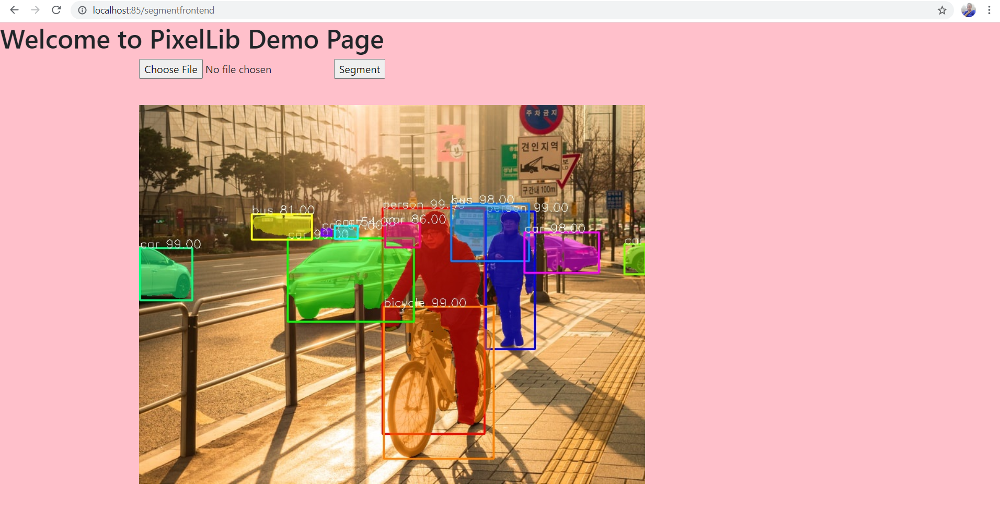
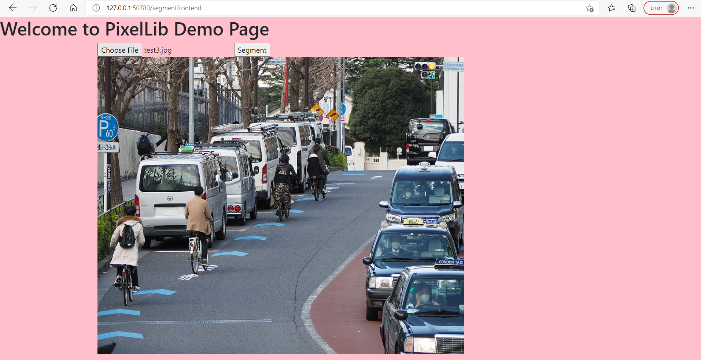
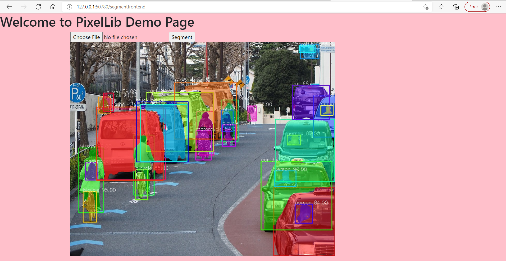

# PixelLib API 
This repository is a collection of codes using docker and kubernetes to deploy a machine learning model as a Rest API for performing image segmentation.
I used docker to build an image segmentation API using PixelLib segmentation library and deploy it in Kubernetes.

##  Tutorials 
1 [Docker Image Segmentation Deployment](#Pull-PixelLib-API-from-Dockerhub)

2 [Kubernetes Image Segmentation Deployment](#PixelLib-API-Deployment-on-Kubernetes)


## Note:
**Read this [article](https://medium.com/p/353525ec39b0) I published on the basic concepts of docker and how it is used to build MachineLearning Rest APIs.**

### Install Docker

**[Windows Installation](https://docs.docker.com/desktop/windows/install/)**

**[Linux Installation](https://docs.docker.com/engine/install/ubuntu/)**

**[macOS Installation](https://docs.docker.com/desktop/mac/install/)**
<br>

## Pull PixelLib API from Dockerhub

```
sudo docker pull ayoolaolafenwa/pixellibapi
```

**Run the API**

```
sudo docker run -p 80:5000 ayoolaolafenwa/pixellibapi
```


<br/>

**Code For API Testing**

``` python
import requests

results = requests.post("http://localhost:85/segmentapi", files = {"image": open("sample.jpeg", "rb")}).json()
print(results["outputs"])
```

**Results**

```
{'boxes': [[372, 158, 528, 504], [530, 163, 605, 374], [1, 219, 81, 299], [374, 309, 542, 542], [227, 204, 420, 332], [477, 151, 596, 239], [589, 195, 703, 257], [742, 213, 774, 259], [376, 181, 429, 218], [172, 167, 264, 206], [279, 190, 294, 200], [299, 185, 334, 205]], 'class_ids': [0, 0, 2, 1, 2, 5, 2, 2, 2, 5, 2, 2], 'class_names': ['person', 'person', 'car', 'bicycle', 'car', 'bus', 'car', 'car', 'car', 'bus', 'car', 'car'], 'mask_shape': [581, 774, 12], 'object_counts': {'bicycle': 1, 'bus': 2, 'car': 7, 'person': 2}, 'scores': [99, 99, 99, 99, 99, 98, 98, 97, 86, 81, 57, 54]}
```

The outputs include a lot of details about the objects detected in the image which include the **box coordinates values**, **class ids**, **class names**, **object counts**, **segmentation mask shape** and **prediction scores**.

**Obtain the segmentation masks**

Obtain the segmentation masks of the objects segmented using this code below;

```python
import requests
import numpy as np

results = requests.post("http://localhost:85/segmentapi", files = {"image": open("sample.jpeg", "rb")}).json()
segmentation_masks = results["mask_values"]
#convert the masks to numpy arrays for proper output format
masks_numpy_array = np.array(segmentation_masks)
print(masks_numpy_array)
```
**Note**: If you print the **results["mask_values"]** directly it will be too long for a proper view format because  the segmentation results by the API is in list.
It is better you convert it to numpy arrays to view the actual segmentation values. 


## Image Segmentation Frontend API 

I provided a simple web API to test on images directly and visualize the results. Visit the port you are running the API e.g *localhost:80* and perform a simple web image segmentation.


<br/>
You can choose any image and press the button segment, it will display an output segmented image within seconds.




## Build A Custom Docker Image

The code for building this API is available in this repository, clone it, make modifications and build your own custom image. 

**Clone Repository**

```
git clone ayoolaolafenwa/pixellibapi

```
Download the [PointRend model](https://github.com/ayoolaolafenwa/PixelLib/releases/download/0.2.0/pointrend_resnet50.pkl) used for image segmentation and put it in the folder directory PixelLibAPI.


**sample folder directory**
```
└── ImageSegmentationAPI
        ├── app.py
        ├── Dockerfile
        ├── pointrend_resnet50.pkl
    
        └── templates
            ├── segment.html

```

**Build Docker Image**

```
cd ImageSegmentationAPI

docker build -t yourimagename
```


# PixelLib API Deployment on Kubernetes

### Local Kubernetes Deployment

**Note**:
Ensure that you have docker installed before installing **kubectl**. 

### Install Kubectl

**[Windows Installation](https://kubernetes.io/docs/tasks/tools/install-kubectl-windows/)**

**[Linux Installation](https://kubernetes.io/docs/tasks/tools/install-kubectl-linux/)**

**[macOS Installation](https://kubernetes.io/docs/tasks/tools/install-kubectl-macos/)**
<br>

### Install Minikube
**Follow this [guide](https://v1-18.docs.kubernetes.io/docs/tasks/tools/install-minikube/) for Minikube Installation.**

<br>

### Start Minikube
```
minikube start
```
<br>

**Clone Repository**

```
git clone ayoolaolafenwa/pixellibapi

```

```
cd KubernetesDeployment
```

**Create PixelLibAPI deployment**
```
kubectl apply -f pixellib_deployment.yml
```

This command will create the pixellib pod deployment and service. This will be the log:
```
deployment.apps/pixellib-deployment created
service/pixellib-service created
```
**Check the kubernetes pod deployment logs**

```
kubectl get pods
```

```
NAME                                   READY   STATUS              RESTARTS   AGE
pixellib-deployment-5b9f884bd5-f9k2m   0/1     ContainerCreating   0          8s
pixellib-deployment-5b9f884bd5-k5b62   0/1     ContainerCreating   0          8s
```

In the logs the status of the pods is *ContainerCreating* which means that the pods are still creating. If the internet speed is fast the pods will create within seconds but if not, it will take some minutes. When it is done the status of the pods will change to *Running*.

```
NAME                                   READY   STATUS    RESTARTS   AGE
pixellib-deployment-5b9f884bd5-f9k2m   1/1     Running   0          2m32s
pixellib-deployment-5b9f884bd5-k5b62   1/1     Running   0          2m32s
```

**Start the PixelLib deployment Service**

```
minikube service pixellib-service
```

This will be the output log:
```
|-----------|------------------|-------------|---------------------------|
| NAMESPACE |       NAME       | TARGET PORT |            URL            |
|-----------|------------------|-------------|---------------------------|
| default   | pixellib-service |          80 | http://192.168.49.2:30184 |
|-----------|------------------|-------------|---------------------------|
* Starting tunnel for service pixellib-service.
|-----------|------------------|-------------|------------------------|
| NAMESPACE |       NAME       | TARGET PORT |          URL           |
|-----------|------------------|-------------|------------------------|
| default   | pixellib-service |             | http://127.0.0.1:50780 |
|-----------|------------------|-------------|------------------------|
* Opening service default/pixellib-service in default browser...
! Because you are using a Docker driver on windows, the terminal needs to be open to run it.
```

The pixellib service will open in your default browser and if not, copy the second url and paste it in a browser. 

This will be the page loaded. You can upload any image to test the service.


<br>

**Uploaded Image**


<br>

**Segmented Image**




## Test Kubernetes Deployment Service Segmentation API

``` python
import requests

res = requests.post("path-to-service-url", files = {"image":open("sample.jpg", "rb")}).json()
print(res["outputs"])
```

**test image**


``` python
import requests

out = requests.post("http://127.0.0.1:50780/segmentapi", files = {"image":open("sample.jpeg", "rb")}).json()
print(out["outputs"])
```

**Ouputs**

```
{'boxes': [[32, 380, 127, 612], [245, 334, 324, 549], [584, 208, 649, 356], [58, 433, 106, 495], [787, 521, 1021, 767], [487, 250, 555, 405], [49, 537, 101, 646], [738, 428, 1012, 674], [109, 197, 155, 255], [789, 462, 873, 518], [890, 8, 962, 60], [252, 458, 299, 565], [839, 334, 891, 369], [941, 193, 1024, 
341], [870, 582, 937, 650], [485, 318, 545, 423], [293, 181, 553, 392], [403, 146, 643, 348], [584, 244, 630, 320], [101, 240, 368, 494], [885, 13, 947, 38], [793, 277, 1023, 501], [859, 155, 1002, 278], [101, 233, 359, 496], [128, 183, 167, 249], [255, 214, 456, 430], [588, 297, 639, 374], [969, 227, 1017, 263], [687, 229, 719, 283], [271, 224, 451, 428]], 'class_ids': [0, 0, 0, 24, 2, 0, 1, 2, 24, 0, 9, 1, 0, 2, 0, 3, 7, 7, 24, 2, 9, 2, 2, 7, 0, 7, 1, 0, 2, 2], 'class_names': ['person', 'person', 'person', 'backpack', 'car', 'person', 'bicycle', 'car', 'backpack', 'person', 'traffic light', 'bicycle', 'person', 'car', 'person', 'motorcycle', 'truck', 'truck', 'backpack', 'car', 'traffic light', 'car', 'car', 'truck', 'person', 'truck', 'bicycle', 'person', 'car', 'car'], 'mask_shape': [768, 1024, 30], 'object_counts': {'backpack': 3, 'bicycle': 3, 'car': 8, 'motorcycle': 1, 'person': 9, 'traffic light': 2, 'truck': 4}, 'scores': [99, 99, 99, 99, 97, 96, 95, 92, 91, 90, 89, 88, 87, 86, 84, 84, 84, 84, 76, 72, 72, 71, 68, 68, 59, 58, 57, 57, 55, 50]}
```

